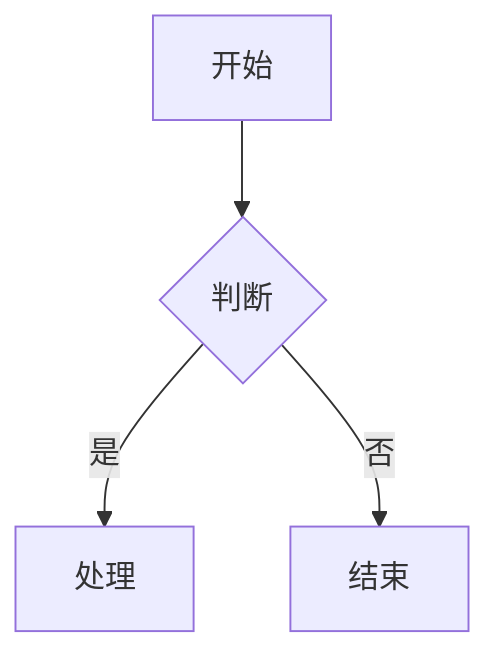
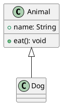

# Markdown 预览器

这是一个极简风格的 Markdown 文件预览工具，专为 GitHub Pages 设计，完全静态，无需后端。

## 功能特点

- 📂 **自动发现** - 通过 GitHub API 自动扫描仓库中的所有 .md 文件
- 🌳 **树形文件结构** - 自动构建文档目录树
- 📱 **完美适配移动端** - 响应式设计，支持各种设备
- 🎨 **优雅设计** - 浅紫浅粉色系，极简风格
- ✨ **流畅动画** - 丝滑的加载和导航效果
- 🔒 **纯前端** - 无需后端或构建工具

## 支持格式

### 基本 Markdown 格式
- 标题、段落、引用
- 列表、表格
- 粗体、斜体、删除线
- 代码块、行内代码
- 链接、图片
- 水平线

### Mermaid 图表
支持 18+ 种图表类型：
- 流程图、时序图、类图
- 状态图、实体关系图、甘特图
- 饼图、Git 分支图、用户旅程图
- 思维导图、时间线图、四象限图
- 块图、C4 架构图、XY 图表
- 网络拓扑图、看板、需求图

使用示例：


### PlantUML 图表
支持多种图表类型：
- 类图、对象图、用例图
- 时序图、活动图、状态图
- 组件图、部署图、包图
- 通信图、定时图、交互概览图
- 思维导图、工作分解结构图
- 网络拓扑图、架构图
- 实体关系图、流程图
- JSON/XML 数据图、线框图
- 用户旅程图、需求图
- 时间线图、看板图
- 电路图、正则表达式图
- 数学公式图

使用示例：


## 快速开始

### 在 GitHub Pages 上使用：

1. 将以下文件复制到你的 GitHub 仓库根目录：
   - `index.html`
   - `styles.css`
   - `app.js`

2. 编辑 `app.js` 中的 `CONFIG` 配置你的仓库信息：
   ```javascript
   const CONFIG = {
     owner: '你的用户名',
     repo: '你的仓库名'
   };
   ```

3. 在仓库设置中启用 GitHub Pages，选择 `main` 分支或其他分支

4. 访问 `https://你的用户名.github.io/仓库名/`

### 添加新文档

只需在仓库的任何位置添加 `.md` 文件，系统会自动发现并显示在侧边栏！

## 配置说明

在 `app.js` 中配置：

```javascript
const CONFIG = {
  owner: 'theforeveriris',  // 你的 GitHub 用户名
  repo: 'md-preview'        // 你的仓库名称
};
```

## 文件结构

你的仓库可以有任意的文件结构，所有 .md 文件都会被自动发现：

```
你的仓库/
├── index.html       # 主页面（必须在根目录）
├── styles.css       # 样式文件（必须在根目录）
├── app.js          # 功能逻辑和配置（必须在根目录）
├── README.md        # 你的文档
├── docs/           # 任意结构的文档目录
│   ├── guide.md
│   └── ...
└── any/            # 任意位置的文档
    └── file.md
```

## 代码示例

```javascript
const greeting = "Hello, World!";
console.log(greeting);
```

## 引用示例

> 这是一个引用示例
> 可以用来展示重要的文字内容

## 列表

- 第一项
- 第二项
- 第三项

## 表格

| 功能 | 描述 |
|------|------|
| 自动发现 | 通过 GitHub API 扫描所有 .md 文件 |
| 实时预览 | Markdown 即时渲染 |
| 响应式布局 | 支持各种屏幕尺寸 |
