# PlantUML 图表示例

本文档展示了 PlantUML 支持的各类图表及其渲染效果。

---

## 1. 类图 (Class Diagram)

### 基础类图

```txt
@startuml
class Animal {
    +String name
    +int age
    +makeSound()
    +eat()
}
class Dog {
    +String breed
    +bark()
    +fetch()
}
class Cat {
    +boolean indoor
    +meow()
    +scratch()
}

Animal <|-- Dog : 继承
Animal <|-- Cat : 继承
@enduml
```

**渲染效果：**

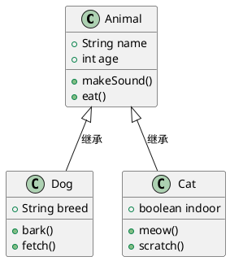

---

## 2. 顺序图 (Sequence Diagram)

### 基础顺序图

```txt
@startuml
participant User
participant Client
participant Server
participant Database

User -> Client: 输入登录信息
Client -> Server: 发送登录请求
activate Server
Server -> Database: 查询用户
activate Database
Database --> Server: 返回用户数据
deactivate Database
Server --> Client: 返回认证结果
deactivate Server
Client --> User: 显示登录状态
@enduml
```

**渲染效果：**

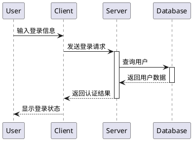

### 带循环的顺序图

```txt
@startuml
participant User
participant Application
participant API
database Database

User -> Application: 请求数据列表
loop 每次获取一页
    Application -> API: GET /items?page=N
    API -> Database: SELECT * LIMIT 10
    Database --> API: 返回数据
    API --> Application: 返回 JSON
end
Application --> User: 显示第 N 页
@enduml
```

**渲染效果：**

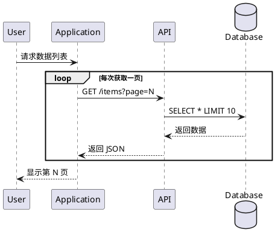

---

## 3. 用例图 (Use Case Diagram)

### 电商系统用例图

```txt
@startuml
left to right direction

actor 用户 as user
actor 管理员 as admin

rectangle 电商系统 {
    usecase 登录 as UC1
    usecase 浏览商品 as UC2
    usecase 加入购物车 as UC3
    usecase 下单 as UC4
    usecase 支付 as UC5
    usecase 评价商品 as UC6
    usecase 管理商品 as UC7
    usecase 管理订单 as UC8
}

user --> UC1
user --> UC2
user --> UC3
user --> UC4
user --> UC5
user --> UC6

admin --> UC1
admin --> UC7
admin --> UC8
@enduml
```

**渲染效果：**

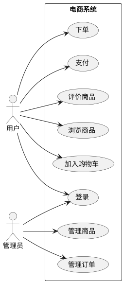

---

## 4. 活动图 (Activity Diagram)

### 订单处理流程

```txt
@startuml
start
:用户下单;
:选择商品;
:加入购物车;
if (继续购物?) then (是)
    :继续选购;
    :返回选择商品;
else (否)
endif
:结算订单;
:选择支付方式;
if (余额充足?) then (是)
    :支付成功;
else (否)
    :支付失败;
    stop
endif
:生成订单;
:发货;
:收货确认;
:订单完成;
stop
@enduml
```

**渲染效果：**

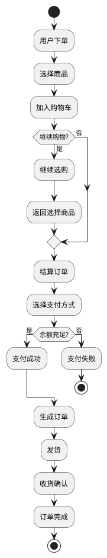

---

## 5. 状态图 (State Diagram)

### 订单状态流转

```txt
@startuml
[*] --> 待支付

待支付 --> 已取消 : 超时/用户取消
待支付 --> 已支付 : 支付成功

已支付 --> 已发货 : 商家发货
已支付 --> 已取消 : 退款

已发货 --> 运输中 : 开始配送

运输中 --> 已到达 : 到达目的站
运输中 --> 已退款 : 退货

已到达 --> 已签收 : 用户确认收货

已签收 --> 已完成 : 完成评价
已签收 --> 已退款 : 申请售后

已退款 --> [*]
已完成 --> [*]
已取消 --> [*]

note right of 待支付 : 用户刚创建订单
note right of 已支付 : 等待商家发货
note right of 已完成 : 整个流程结束
@enduml
```

**渲染效果：**

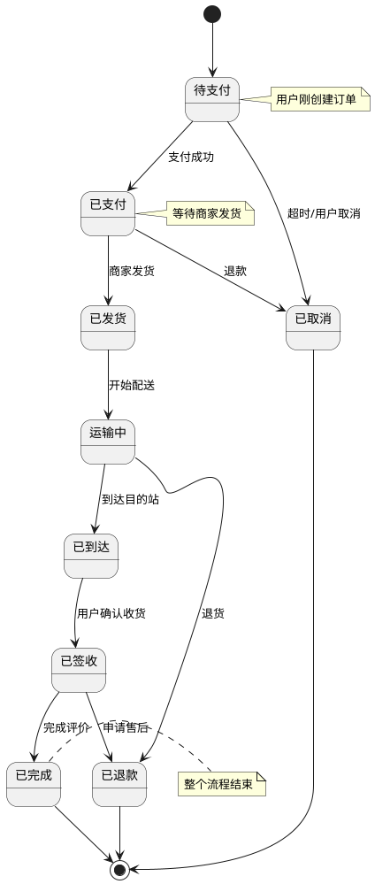

---

## 6. 组件图 (Component Diagram)

### 微服务架构组件图

```txt
@startuml
package "前端层" {
    [Web 应用] as Web
    [移动 App] as Mobile
}

package "网关层" {
    [API 网关] as Gateway
}

package "服务层" {
    [用户服务] as UserService
    [订单服务] as OrderService
    [商品服务] as ProductService
    [支付服务] as PaymentService
}

package "数据层" {
    database 用户数据库 as UserDB
    database 订单数据库 as OrderDB
    database 商品数据库 as ProductDB
}

Web --> Gateway
Mobile --> Gateway
Gateway --> UserService
Gateway --> OrderService
Gateway --> ProductService
Gateway --> PaymentService

UserService --> UserDB
OrderService --> OrderDB
ProductService --> ProductDB
PaymentService --> OrderDB
@enduml
```

**渲染效果：**

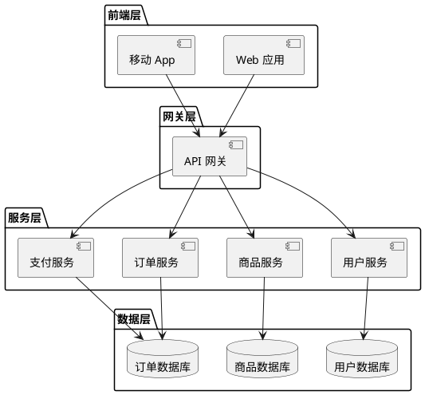

---

## 7. 部署图 (Deployment Diagram)

### 云原生应用部署

```txt
@startuml
node "用户设备" {
    [浏览器] as Browser
    [手机 App] as MobileApp
}

cloud "云服务" {
    node "负载均衡" {
        [Nginx] as LB
    }

    node "Kubernetes 集群" {
        [Web Pod 1] as Web1
        [Web Pod 2] as Web2
        [API Pod 1] as API1
        [API Pod 2] as API2
    }

    database "数据库集群" {
        database "主库" as PrimaryDB
        database "从库" as ReplicaDB
    }

    node "缓存集群" {
        [Redis Master] as RedisMaster
        [Redis Slave] as RedisSlave
    }

    node "消息队列" {
        [Kafka] as MQ
    }
}

Browser --> LB
MobileApp --> LB
LB --> Web1
LB --> Web2
Web1 --> API1
Web2 --> API2
API1 --> RedisMaster
API2 --> RedisMaster
API1 --> PrimaryDB
API2 --> PrimaryDB
PrimaryDB --> ReplicaDB
API1 --> MQ
API2 --> MQ
@enduml
```

**渲染效果：**

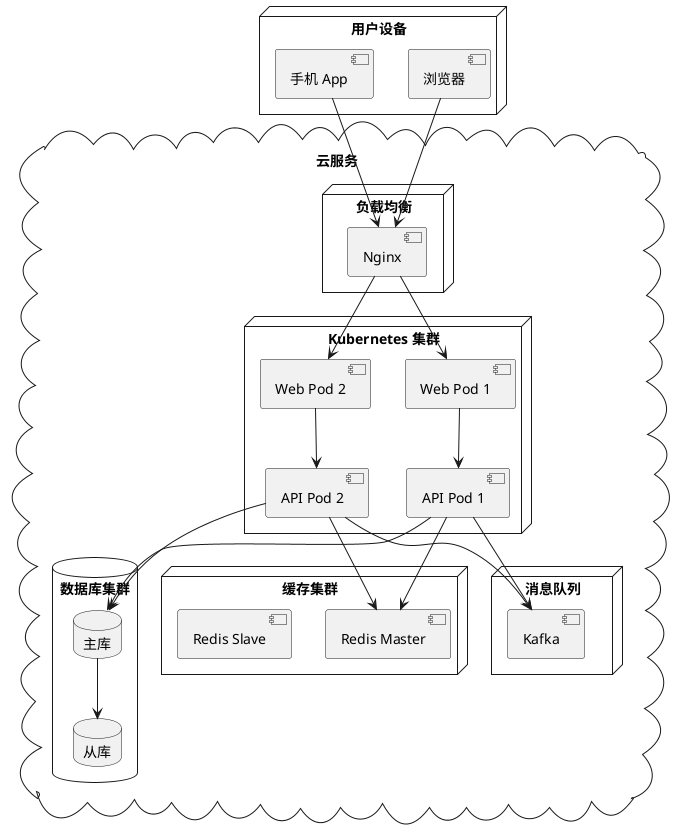

---

## 8. 对象图 (Object Diagram)

### 学生选课系统对象实例

```txt
@startuml
object 学生1 {
    学号 = 2024001
    姓名 = 张三
    年级 = 大二
}
object 学生2 {
    学号 = 2024002
    姓名 = 李四
    年级 = 大二
}
object 课程 {
    课程号 = CS101
    课程名 = 数据结构
    学分 = 4
}
object 选课记录1 {
    成绩 = 92
    状态 = 已完成
}
object 选课记录2 {
    成绩 = NULL
    状态 = 学习中
}

学生1 --> 选课记录1
学生2 --> 选课记录2
课程 --> 选课记录1
课程 --> 选课记录2
@enduml
```

**渲染效果：**

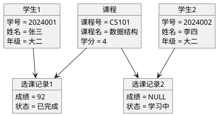

---

## 9. 包图 (Package Diagram)

### 企业应用包结构

```txt
@startuml
package com.company #DDDDDD {
    package controller #LightBlue {
        class UserController
        class OrderController
        class ProductController
    }

    package service #LightGreen {
        class UserService
        class OrderService
        class ProductService
    }

    package repository #LightYellow {
        class UserRepository
        class OrderRepository
        class ProductRepository
    }

    package model #LightPink {
        class User
        class Order
        class Product
        class OrderItem
    }

    package util #LightGray {
        class DateUtils
        class StringUtils
        class ValidationUtils
    }

    package config #LightCoral {
        class AppConfig
        class DatabaseConfig
    }
}

controller --> service
controller --> model
service --> repository
service --> model
service --> util
repository --> model
repository --> config
@enduml
```

**渲染效果：**

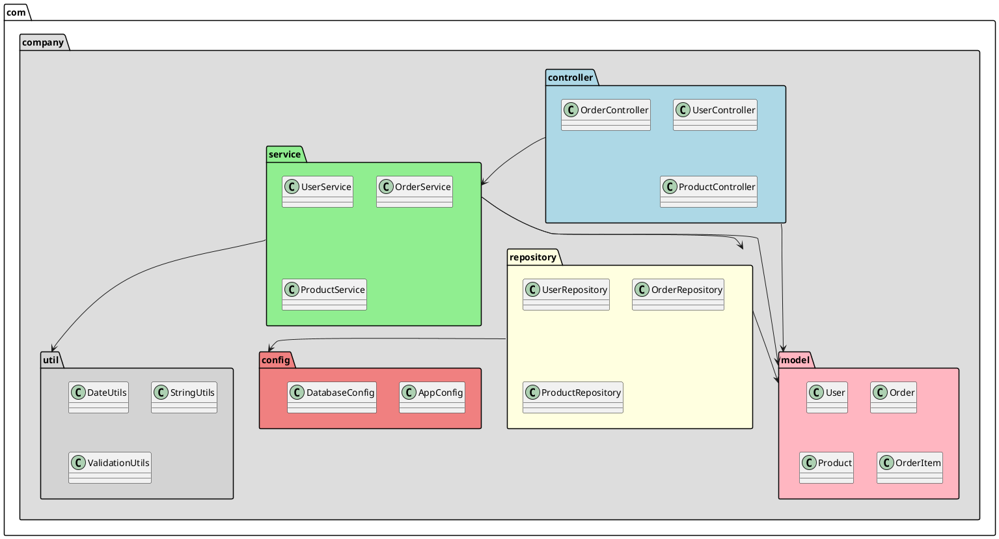

---

## 10. 通信图 (Communication Diagram)

### 多人协作通信

```txt
@startuml
participant 客户端A as A
participant 服务器 as S
participant 客户端B as B
participant 数据库 as DB

A -> S: 发送消息给 B
activate S
S -> DB: 存储消息
activate DB
DB --> S: 确认存储
deactivate DB
S -> B: 转发消息
activate B
B --> S: 确认收到
S --> A: 发送状态更新
deactivate B
deactivate S
@enduml
```

**渲染效果：**

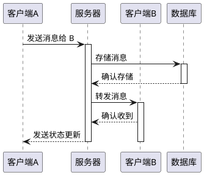

---

## 11. 定时图 (Timing Diagram)

### API 响应时序

```txt
@startuml
title API 响应时序图
concise "客户端" as C
concise "服务器" as S
concise "数据库" as DB

@0
C is idle
S is idle
DB is idle

@100
C is 发送请求
S is 接收请求

@300
S is 处理业务

@600
S is 查询数据库
DB is 执行SQL

@800
DB is 返回结果
S is 接收结果
DB is idle

@1100
S is 生成响应

@1300
S is 发送响应
C is 接收响应

@1450
C is 处理结果
S is idle

@1500
C is idle
@enduml
```

**渲染效果：**

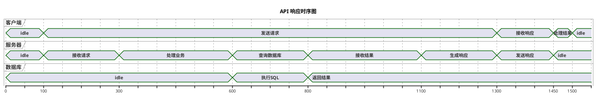

---

## 12. 交互概览图 (Interaction Overview)

### 系统交互概览

```txt
@startuml
start
:用户登录;
if (验证成功?) then (是)
    :显示首页;
    :加载用户数据;
    fork
        :加载通知;
    fork again
        :加载待办事项;
    endfork
    :展示仪表盘;
else (否)
    :显示错误信息;
    stop
endif

:用户操作;
if (查看详情?) then (是)
    :加载详情数据;
    :显示详情页面;
else (否)
    :执行快捷操作;
endif
stop
@enduml
```

**渲染效果：**

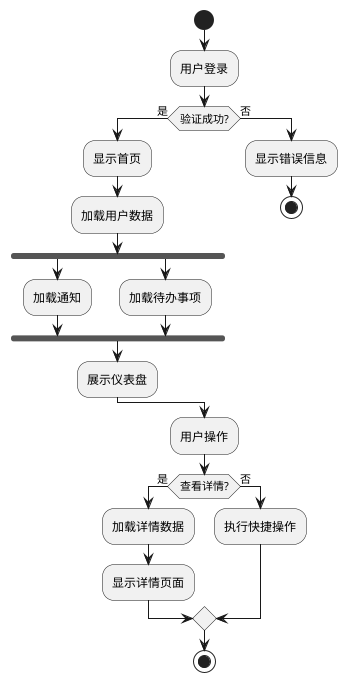

---

## 13. 思维导图 (MindMap)

### 项目规划思维导图

```txt
@startuml
<style>
mindmap {
    .primary {
        BackgroundColor #DarkSalmon
    }
    .secondary {
        BackgroundColor #LightBlue
    }
    .tertiary {
        BackgroundColor #LightGreen
    }
}
</style>
#PlantUML 思维导图示例

* 项目规划

** 设计阶段

*** 需求分析
**** 功能需求
**** 非功能需求

*** UI/UX设计
**** 原型设计
**** 视觉设计

** 开发阶段

*** 后端开发
**** API接口
**** 业务逻辑

*** 前端开发
**** 页面开发
**** 组件开发

** 测试阶段

*** 单元测试
*** 集成测试
*** 系统测试

** 部署阶段

*** 环境准备
*** 部署执行
*** 监控运维
@enduml
```

**渲染效果：**

```plantuml
@startuml
<style>
mindmap {
    .primary {
        BackgroundColor #DarkSalmon
    }
    .secondary {
        BackgroundColor #LightBlue
    }
    .tertiary {
        BackgroundColor #LightGreen
    }
}
</style>
#PlantUML 思维导图示例

* 项目规划

** 设计阶段

*** 需求分析
**** 功能需求
**** 非功能需求

*** UI/UX设计
**** 原型设计
**** 视觉设计

** 开发阶段

*** 后端开发
**** API接口
**** 业务逻辑

*** 前端开发
**** 页面开发
**** 组件开发

** 测试阶段

*** 单元测试
*** 集成测试
*** 系统测试

** 部署阶段

*** 环境准备
*** 部署执行
*** 监控运维
@enduml
```

---

## 14. 工作分解结构图 (WBS)

### 软件项目 WBS

```txt
@startuml
<style>
wbsDiagram {
    .design {
        BackgroundColor #LightBlue
    }
    .dev {
        BackgroundColor #LightGreen
    }
    .test {
        BackgroundColor #LightYellow
    }
}
</style>
#APP 开发项目 WBS

* APP 开发项目

** 1 设计阶段

*** 1.1 需求分析
**** 1.1.1 功能需求
**** 1.1.2 非功能需求

*** 1.2 UI设计
**** 1.2.1 原型设计
**** 1.2.2 视觉设计

** 2 开发阶段

*** 2.1 后端开发
**** 2.1.1 数据库设计
**** 2.1.2 API开发
**** 2.1.3 服务端测试

*** 2.2 前端开发
**** 2.2.1 页面开发
**** 2.2.2 组件开发
**** 2.2.3 集成测试

** 3 测试阶段

*** 3.1 单元测试
*** 3.2 集成测试
*** 3.3 系统测试
*** 3.4 验收测试

** 4 部署阶段

*** 4.1 服务器部署
*** 4.2 应用发布
*** 4.3 监控运维
@enduml
```

**渲染效果：**

```plantuml
@startuml
<style>
wbsDiagram {
    .design {
        BackgroundColor #LightBlue
    }
    .dev {
        BackgroundColor #LightGreen
    }
    .test {
        BackgroundColor #LightYellow
    }
}
</style>
#APP 开发项目 WBS

* APP 开发项目

** 1 设计阶段

*** 1.1 需求分析
**** 1.1.1 功能需求
**** 1.1.2 非功能需求

*** 1.2 UI设计
**** 1.2.1 原型设计
**** 1.2.2 视觉设计

** 2 开发阶段

*** 2.1 后端开发
**** 2.1.1 数据库设计
**** 2.1.2 API开发
**** 2.1.3 服务端测试

*** 2.2 前端开发
**** 2.2.1 页面开发
**** 2.2.2 组件开发
**** 2.2.3 集成测试

** 3 测试阶段

*** 3.1 单元测试
*** 3.2 集成测试
*** 3.3 系统测试
*** 3.4 验收测试

** 4 部署阶段

*** 4.1 服务器部署
*** 4.2 应用发布
*** 4.3 监控运维
@enduml
```

---

## 15. 甘特图 (Gantt Chart)

### 项目进度甘特图

```txt
@startuml
projectscale 1 month
projectzoom 3
title 项目开发计划

saturday are closed
sunday are closed

2024-01-01 to 2024-01-10 is 需求分析 {
    负责人: 产品经理
}

2024-01-11 to 2024-01-20 is 原型设计 {
    负责人: UI设计师
}

2024-01-21 to 2024-02-10 is 系统设计 {
    负责人: 技术负责人
}

2024-02-11 to 2024-04-10 is [后端开发] {
    负责人: 后端团队
}

2024-02-11 to 2024-04-10 is [前端开发] {
    负责人: 前端团队
}

2024-04-11 to 2024-04-20 is 集成测试 {
    负责人: 测试团队
}

2024-04-21 to 2024-04-30 is 部署上线 {
    负责人: 运维团队
}

[需求分析] lasts 10 days
[原型设计] lasts 10 days
[系统设计] lasts 20 days
[后端开发] lasts 60 days
[前端开发] lasts 60 days
[集成测试] lasts 10 days
[部署上线] lasts 10 days

[系统设计] starts at [原型设计]
[后端开发] starts at [系统设计]
[前端开发] starts at [系统设计]
[集成测试] starts at [后端开发]
[部署上线] starts at [集成测试]
@enduml
```

**渲染效果：**

```plantuml
@startuml
projectscale 1 month
projectzoom 3
title 项目开发计划

saturday are closed
sunday are closed

2024-01-01 to 2024-01-10 is 需求分析 {
    负责人: 产品经理
}

2024-01-11 to 2024-01-20 is 原型设计 {
    负责人: UI设计师
}

2024-01-21 to 2024-02-10 is 系统设计 {
    负责人: 技术负责人
}

2024-02-11 to 2024-04-10 is [后端开发] {
    负责人: 后端团队
}

2024-02-11 to 2024-04-10 is [前端开发] {
    负责人: 前端团队
}

2024-04-11 to 2024-04-20 is 集成测试 {
    负责人: 测试团队
}

2024-04-21 to 2024-04-30 is 部署上线 {
    负责人: 运维团队
}

[需求分析] lasts 10 days
[原型设计] lasts 10 days
[系统设计] lasts 20 days
[后端开发] lasts 60 days
[前端开发] lasts 60 days
[集成测试] lasts 10 days
[部署上线] lasts 10 days

[系统设计] starts at [原型设计]
[后端开发] starts at [系统设计]
[前端开发] starts at [系统设计]
[集成测试] starts at [后端开发]
[部署上线] starts at [集成测试]
@enduml
```

---

## 16. 网络拓扑图 (Network Diagram)

### 企业网络拓扑

```txt
@startuml
title 企业网络拓扑图

rectangle 用户区域 {
    node "员工电脑 1" as PC1
    node "员工电脑 2" as PC2
    node "员工电脑 3" as PC3
}

rectangle DMZ {
    node "Web 服务器" as Web
    node "邮件服务器" as Mail
}

rectangle 内部网络 {
    node "应用服务器" as App
    database "数据库服务器" as DB
}

rectangle 安全设备 {
    node "防火墙" as FW
    node "交换机" as Switch
}

PC1 --> Switch
PC2 --> Switch
PC3 --> Switch

Switch --> FW
FW --> Web
FW --> Mail

Web --> App
Mail --> App
App --> DB
@enduml
```

**渲染效果：**

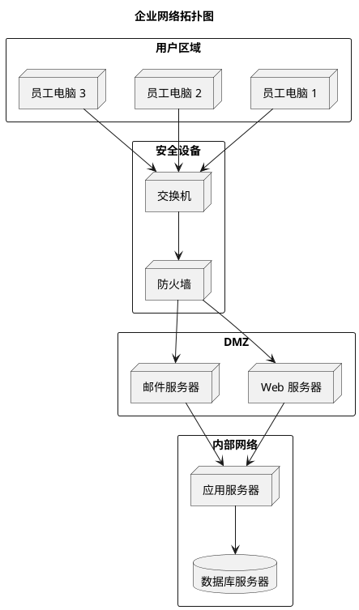

---

## 17. 线框图 (Salt/Wireframe)

### 登录页面线框图

```txt
@startuml
salt
{
    {#
        <color:#Purple>登录系统</color>
        ----
        | 用户名 | [__________________] |
        | 密码   | [__________________] |
        ----
        | [ 登 录 ] | [ 注 册 ] |
        ----
        [ 忘记密码? ]
    }
}
@enduml
```

**渲染效果：**

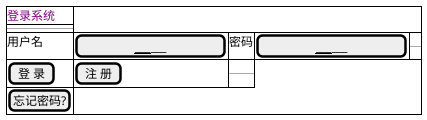

### 仪表盘页面线框图

```txt
@startuml
salt
{
    {#
        <b>用户仪表盘</b>
        --
        {+
            | 欢迎回来, 张三 |
            {X|图标|名称|数值}|
            | [img:https://img.icons8.com/color/48/sale-price-tag.png]|销售额|￥12,500|
            | [img:https://img.icons8.com/color/48/shopping-cart.png]|订单数|156|
            | [img:https://img.icons8.com/color/48/user-group.png]|客户数|89|
        }
        --
        [刷新数据] [导出报表] [设置]
    }
}
@enduml
```

**渲染效果：**

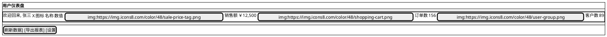

---

## 18. JSON 数据图

### JSON 数据结构

```txt
@startuml
json "用户数据" {
    "id": 1001,
    "name": "张三",
    "email": "zhangsan@example.com",
    "age": 28,
    "active": true,
    "address": {
        "city": "北京",
        "district": "海淀区",
        "street": "中关村大街1号"
    },
    "roles": ["管理员", "用户"],
    "permissions": ["read", "write", "delete"],
    "createdAt": "2024-01-01T08:00:00Z"
}
@enduml
```

**渲染效果：**

```plantuml
@startuml
json "用户数据" {
    "id": 1001,
    "name": "张三",
    "email": "zhangsan@example.com",
    "age": 28,
    "active": true,
    "address": {
        "city": "北京",
        "district": "海淀区",
        "street": "中关村大街1号"
    },
    "roles": ["管理员", "用户"],
    "permissions": ["read", "write", "delete"],
    "createdAt": "2024-01-01T08:00:00Z"
}
@enduml
```

---

## 19. YAML 数据图

### YAML 配置结构

```txt
@startuml
yaml
---
application:
  name: "MyApp"
  version: "1.0.0"
  environment: "production"
database:
  host: "localhost"
  port: 5432
  name: "mydb"
  pool:
    min: 2
    max: 10
cache:
  enabled: true
  type: "redis"
  ttl: 3600
logging:
  level: "info"
  outputs:
    - "console"
    - "file"
---
@enduml
```

**渲染效果：**

```plantuml
@startuml
yaml
---
application:
  name: "MyApp"
  version: "1.0.0"
  environment: "production"
database:
  host: "localhost"
  port: 5432
  name: "mydb"
  pool:
    min: 2
    max: 10
cache:
  enabled: true
  type: "redis"
  ttl: 3600
logging:
  level: "info"
  outputs:
    - "console"
    - "file"
---
@enduml
```

---

## 20. 实体关系图 (ER Diagram)

### 电商系统 ER 图

```txt
@startuml
' hide the spot
hide circle

' avoid problems with angled crows feet
skinparam linetype ortho

entity "用户表" as users {
    * user_id : int <<PK>>
    --
    username : varchar(50)
    email : varchar(100)
    password_hash : varchar(255)
    created_at : timestamp
}

entity "商品表" as products {
    * product_id : int <<PK>>
    --
    name : varchar(200)
    description : text
    price : decimal(10,2)
    stock : int
    category_id : int <<FK>>
}

entity "订单表" as orders {
    * order_id : int <<PK>>
    --
    user_id : int <<FK>>
    total_amount : decimal(10,2)
    status : varchar(20)
    created_at : timestamp
}

entity "订单明细表" as order_items {
    * item_id : int <<PK>>
    --
    order_id : int <<FK>>
    product_id : int <<FK>>
    quantity : int
    price : decimal(10,2)
}

entity "分类表" as categories {
    * category_id : int <<PK>>
    --
    name : varchar(100)
    parent_id : int <<FK>>
}

users ||--o{ orders : places
orders ||--o{ order_items : contains
products ||--o{ order_items : included
categories ||--o{ products : has
@enduml
```

**渲染效果：**

```plantuml
@startuml
' hide the spot
hide circle

' avoid problems with angled crows feet
skinparam linetype ortho

entity "用户表" as users {
    * user_id : int <<PK>>
    --
    username : varchar(50)
    email : varchar(100)
    password_hash : varchar(255)
    created_at : timestamp
}

entity "商品表" as products {
    * product_id : int <<PK>>
    --
    name : varchar(200)
    description : text
    price : decimal(10,2)
    stock : int
    category_id : int <<FK>>
}

entity "订单表" as orders {
    * order_id : int <<PK>>
    --
    user_id : int <<FK>>
    total_amount : decimal(10,2)
    status : varchar(20)
    created_at : timestamp
}

entity "订单明细表" as order_items {
    * item_id : int <<PK>>
    --
    order_id : int <<FK>>
    product_id : int <<FK>>
    quantity : int
    price : decimal(10,2)
}

entity "分类表" as categories {
    * category_id : int <<PK>>
    --
    name : varchar(100)
    parent_id : int <<FK>>
}

users ||--o{ orders : places
orders ||--o{ order_items : contains
products ||--o{ order_items : included
categories ||--o{ products : has
@enduml
```

---

## 21. 用户旅程图 (User Journey)

### 在线购物用户旅程

```txt
@startuml
title 在线购物用户旅程

actor "顾客" as user
user -> (访问网站)
user -> (浏览商品)
user -> (搜索商品)
user -> (查看商品详情)
user -> (比较价格)
user -> (加入购物车)
user -> (查看购物车)
user -> (确认商品)
note right of (确认商品)
  犹豫阶段
end note
user -> (结算订单)
user -> (选择支付方式)
user -> (完成支付)
user -> (等待发货)
user -> (收到发货通知)
user -> (确认收货)
user -> (评价商品)
user -> (完成购物)
@enduml
```

**渲染效果：**

```plantuml
@startuml
title 在线购物用户旅程

actor "顾客" as user
user -> (访问网站)
user -> (浏览商品)
user -> (搜索商品)
user -> (查看商品详情)
user -> (比较价格)
user -> (加入购物车)
user -> (查看购物车)
user -> (确认商品)
note right of (确认商品)
  犹豫阶段
end note
user -> (结算订单)
user -> (选择支付方式)
user -> (完成支付)
user -> (等待发货)
user -> (收到发货通知)
user -> (确认收货)
user -> (评价商品)
user -> (完成购物)
@enduml
```

---

## 22. 需求图 (Requirement Diagram)

### 软件需求追踪

```txt
@startuml
left to right direction

package "业务需求" {
    rectangle BR1 #LightCoral {
        note as BR1Note
        BR1: 提高客户满意度
        BR1: 增加销售收入
        end note
    }
}

package "用户需求" {
    rectangle UR1 #LightBlue {
        note as UR1Note
        UR1: 快速下单
        UR1: 多种支付方式
        end note
    }
    rectangle UR2 #LightBlue {
        note as UR2Note
        UR2: 订单追踪
        UR2: 物流信息
        end note
    }
}

package "功能需求" {
    rectangle FR1 #LightGreen {
        note as FR1Note
        FR1: 第三方登录
        FR1: 快捷支付
        end note
    }
    rectangle FR2 #LightGreen {
        note as FR2Note
        FR2: 物流查询
        FR2: 实时推送
        end note
    }
}

BR1 --> UR1
BR1 --> UR2
BR1 -up-> UR1
BR1 -down-> UR2

UR1 --> FR1
UR2 --> FR2
UR1 -up-> FR2
UR2 -down-> FR1

legend right
  需求追踪关系
  - BR: 业务需求
  - UR: 用户需求
  - FR: 功能需求
endlegend
@enduml
```

**渲染效果：**

```plantuml
@startuml
left to right direction

package "业务需求" {
    rectangle BR1 #LightCoral {
        note as BR1Note
        BR1: 提高客户满意度
        BR1: 增加销售收入
        end note
    }
}

package "用户需求" {
    rectangle UR1 #LightBlue {
        note as UR1Note
        UR1: 快速下单
        UR1: 多种支付方式
        end note
    }
    rectangle UR2 #LightBlue {
        note as UR2Note
        UR2: 订单追踪
        UR2: 物流信息
        end note
    }
}

package "功能需求" {
    rectangle FR1 #LightGreen {
        note as FR1Note
        FR1: 第三方登录
        FR1: 快捷支付
        end note
    }
    rectangle FR2 #LightGreen {
        note as FR2Note
        FR2: 物流查询
        FR2: 实时推送
        end note
    }
}

BR1 --> UR1
BR1 --> UR2
BR1 -up-> UR1
BR1 -down-> UR2

UR1 --> FR1
UR2 --> FR2
UR1 -up-> FR2
UR2 -down-> FR1

legend right
  需求追踪关系
  - BR: 业务需求
  - UR: 用户需求
  - FR: 功能需求
endlegend
@enduml
```

---

## 23. 数据流图 (Data Flow Diagram)

### 订单处理数据流

```txt
@startuml
skinparam componentStyle rectangle

|客户|
start
:提交订单请求;
:选择商品;
:填写配送信息;
:选择支付方式;
note right
  输入数据：
  - 商品列表
  - 配送地址
  - 支付信息
end note

|订单系统|
:接收订单请求;
:验证商品信息;
:计算订单金额;
:检查库存;
if (库存充足?) then (是)
    :创建订单记录;
    :冻结库存;
else (否)
    :提示库存不足;
    :返回错误;
    detach
endif

|支付系统|
:发起支付请求;
:调用第三方支付;
if (支付成功?) then (是)
    :更新订单状态;
    :扣除库存;
    :生成支付凭证;
else (否)
    :回滚订单;
    :释放库存;
    :提示支付失败;
    detach
endif

|配送系统|
:接收发货通知;
:分配配送员;
:开始配送;
:更新物流信息;

|客户|
:收到订单确认;
:查看订单状态;
:等待收货;
stop
@enduml
```

**渲染效果：**

```plantuml
@startuml
skinparam componentStyle rectangle

|客户|
start
:提交订单请求;
:选择商品;
:填写配送信息;
:选择支付方式;
note right
  输入数据：
  - 商品列表
  - 配送地址
  - 支付信息
end note

|订单系统|
:接收订单请求;
:验证商品信息;
:计算订单金额;
:检查库存;
if (库存充足?) then (是)
    :创建订单记录;
    :冻结库存;
else (否)
    :提示库存不足;
    :返回错误;
    detach
endif

|支付系统|
:发起支付请求;
:调用第三方支付;
if (支付成功?) then (是)
    :更新订单状态;
    :扣除库存;
    :生成支付凭证;
else (否)
    :回滚订单;
    :释放库存;
    :提示支付失败;
    detach
endif

|配送系统|
:接收发货通知;
:分配配送员;
:开始配送;
:更新物流信息;

|客户|
:收到订单确认;
:查看订单状态;
:等待收货;
stop
@enduml
```

---

## 24. 架构图 (Architecture Diagram)

### 微服务架构图

```txt
@startuml
title 微服务架构图

package "客户端" {
    [Web 应用] <<react>>
    [移动 App] <<react>>
}

package "网关层" {
    [API Gateway] <<nginx>>
}

package "用户服务" {
    [用户服务] <<java>>
    database "用户数据库" <<mysql>>
}

package "订单服务" {
    [订单服务] <<java>>
    database "订单数据库" <<postgresql>>
}

package "商品服务" {
    [商品服务] <<java>>
    database "商品数据库" <<mysql>>
}

package "公共组件" {
    [缓存服务] <<redis>>
    [消息队列] <<java>>
    [配置中心] <<java>>
}

[Web 应用] --> [API Gateway]
[移动 App] --> [API Gateway]

[API Gateway] --> [用户服务]
[API Gateway] --> [订单服务]
[API Gateway] --> [商品服务]

[用户服务] --> [用户数据库]
[订单服务] --> [订单数据库]
[商品服务] --> [商品数据库]

[用户服务] --> [缓存服务]
[订单服务] --> [缓存服务]
[商品服务] --> [缓存服务]

[订单服务] --> [消息队列]
[商品服务] --> [消息队列]

[用户服务] --> [配置中心]
[订单服务] --> [配置中心]
[商品服务] --> [配置中心]
@enduml
```

**渲染效果：**

```plantuml
@startuml
title 微服务架构图

package "客户端" {
    [Web 应用] <<react>>
    [移动 App] <<react>>
}

package "网关层" {
    [API Gateway] <<nginx>>
}

package "用户服务" {
    [用户服务] <<java>>
    database "用户数据库" <<mysql>>
}

package "订单服务" {
    [订单服务] <<java>>
    database "订单数据库" <<postgresql>>
}

package "商品服务" {
    [商品服务] <<java>>
    database "商品数据库" <<mysql>>
}

package "公共组件" {
    [缓存服务] <<redis>>
    [消息队列] <<java>>
    [配置中心] <<java>>
}

[Web 应用] --> [API Gateway]
[移动 App] --> [API Gateway]

[API Gateway] --> [用户服务]
[API Gateway] --> [订单服务]
[API Gateway] --> [商品服务]

[用户服务] --> [用户数据库]
[订单服务] --> [订单数据库]
[商品服务] --> [商品数据库]

[用户服务] --> [缓存服务]
[订单服务] --> [缓存服务]
[商品服务] --> [缓存服务]

[订单服务] --> [消息队列]
[商品服务] --> [消息队列]

[用户服务] --> [配置中心]
[订单服务] --> [配置中心]
[商品服务] --> [配置中心]
@enduml
```

---

## 25. 电路图 (Circuit Diagram)

### 简单电路图

```txt
@startuml
title 简单电路图

rectangle "用户设备" {
    [LED] as led <<发光二极管>>
}

rectangle "电路" {
    [电源\nV1\n9V] as v1 <<电源>>
    [电阻\nR1\n330Ω] as r1 <<电阻>>
    [开关\nS1] as s1 <<开关>>
}

v1 --> s1
s1 --> r1
r1 --> led
led --> v1
@enduml
```

**渲染效果：**

```plantuml
@startuml
title 简单电路图

rectangle "用户设备" {
    [LED] as led <<发光二极管>>
}

rectangle "电路" {
    [电源\nV1\n9V] as v1 <<电源>>
    [电阻\nR1\n330Ω] as r1 <<电阻>>
    [开关\nS1] as s1 <<开关>>
}

v1 --> s1
s1 --> r1
r1 --> led
led --> v1
@enduml
```

---

## 26. 正则表达式图

### 正则表达式可视化

```txt
@startuml
skinparam backgroundColor #FEFEFE
left to right direction

state "开始" as S
state "匹配数字" as D1
state "匹配点号" as P
state "匹配数字" as D2
state "匹配结束" as E

S --> D1 : [0-9]
D1 --> D1 : [0-9]
D1 --> P : \.
P --> D2 : [0-9]
D2 --> D2 : [0-9]
D2 --> E : 结束

note as N1
输入示例：
- 123.456 ✓
- 99.99 ✓
- 1.2.3 ✗
- abc ✗
end note

note as N2
正则表达式：
^[0-9]+\.[0-9]+$

匹配小数格式
end note
@enduml
```

**渲染效果：**

```plantuml
@startuml
skinparam backgroundColor #FEFEFE
left to right direction

state "开始" as S
state "匹配数字" as D1
state "匹配点号" as P
state "匹配数字" as D2
state "匹配结束" as E

S --> D1 : [0-9]
D1 --> D1 : [0-9]
D1 --> P : \.
P --> D2 : [0-9]
D2 --> D2 : [0-9]
D2 --> E : 结束

note as N1
输入示例：
- 123.456 ✓
- 99.99 ✓
- 1.2.3 ✗
- abc ✗
end note

note as N2
正则表达式：
^[0-9]+\.[0-9]+$

匹配小数格式
end note
@enduml
```

---

## 27. 数学公式图

### 数学公式可视化

```txt
@startuml
skinparam backgroundColor #FEFEFE
title 数学公式与推导

note as Formula1
**勾股定理**

a² + b² = c²

其中：
- a, b 为直角边
- c 为斜边
end note

note as Formula2
**欧拉公式**

e^(iπ) + 1 = 0

最美丽的数学公式：
- e: 自然常数
- i: 虚数单位
- π: 圆周率
- 1: 单位元
- 0: 零元
end note

note as Formula3
**二次方程求根公式**

x = (-b ± √(b²-4ac)) / 2a

判别式 Δ = b² - 4ac：
- Δ > 0: 两个不等实根
- Δ = 0: 两个相等实根
- Δ < 0: 两个共轭复根
end note

note as Formula4
**求和公式**

∑(i=1 to n) i = n(n+1)/2

示例：
∑(i=1 to 100) i = 5050
end note

Formula1 -down-> Formula2
Formula2 -down-> Formula3
Formula3 -down-> Formula4
@enduml
```

**渲染效果：**

```plantuml
@startuml
skinparam backgroundColor #FEFEFE
title 数学公式与推导

note as Formula1
**勾股定理**

a² + b² = c²

其中：
- a, b 为直角边
- c 为斜边
end note

note as Formula2
**欧拉公式**

e^(iπ) + 1 = 0

最美丽的数学公式：
- e: 自然常数
- i: 虚数单位
- π: 圆周率
- 1: 单位元
- 0: 零元
end note

note as Formula3
**二次方程求根公式**

x = (-b ± √(b²-4ac)) / 2a

判别式 Δ = b² - 4ac：
- Δ > 0: 两个不等实根
- Δ = 0: 两个相等实根
- Δ < 0: 两个共轭复根
end note

note as Formula4
**求和公式**

∑(i=1 to n) i = n(n+1)/2

示例：
∑(i=1 to 100) i = 5050
end note

Formula1 -down-> Formula2
Formula2 -down-> Formula3
Formula3 -down-> Formula4
@enduml
```

---

## 总结

本文档展示了 PlantUML 支持的各类图表，包括：

1. **类图** - 类和接口的关系
2. **顺序图** - 对象间的消息传递
3. **用例图** - 系统功能需求
4. **活动图** - 工作流程
5. **状态图** - 状态转换
6. **组件图** - 系统组件结构
7. **部署图** - 硬件/软件部署
8. **对象图** - 对象实例
9. **包图** - 命名空间/模块
10. **通信图** - 对象间协作
11. **定时图** - 时间序列
12. **交互概览图** - 复杂交互
13. **思维导图** - 脑图结构
14. **工作分解结构** - 项目分解
15. **甘特图** - 项目进度
16. **网络拓扑图** - 网络结构
17. **线框图** - UI 原型
18. **JSON 数据图** - JSON 结构
19. **YAML 数据图** - YAML 配置
20. **实体关系图** - 数据库设计
21. **用户旅程图** - 用户体验
22. **需求图** - 需求追踪
23. **数据流图** - 数据处理
24. **架构图** - 系统架构
25. **电路图** - 电子电路
26. **正则表达式图** - 状态机
27. **数学公式图** - 数学公式

更多详细信息请参考 [PlantUML 官方文档](https://plantuml.com/zh/)。
