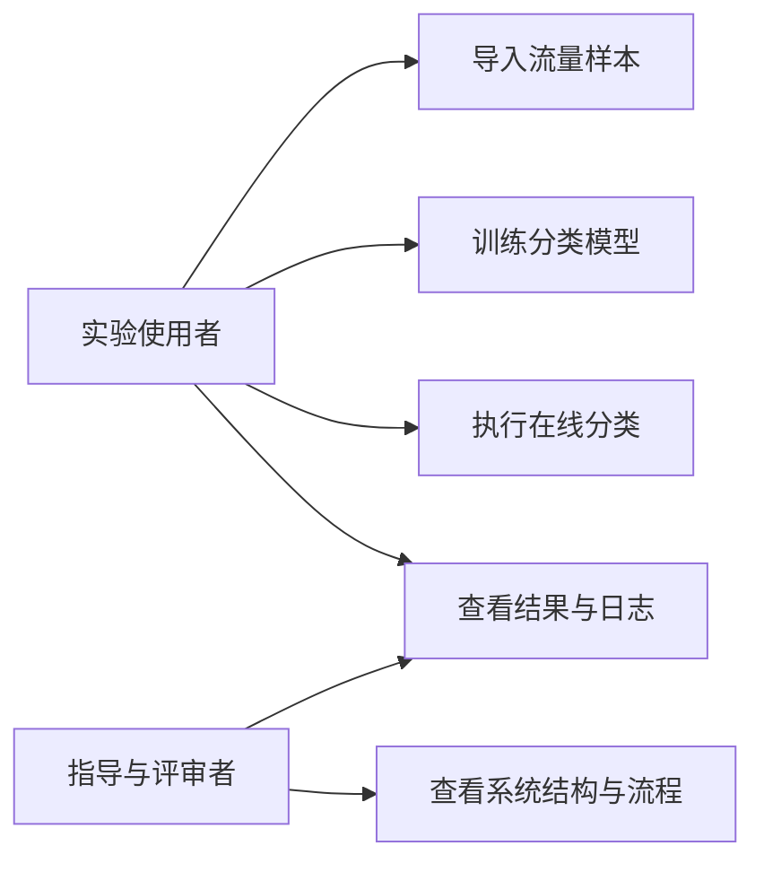
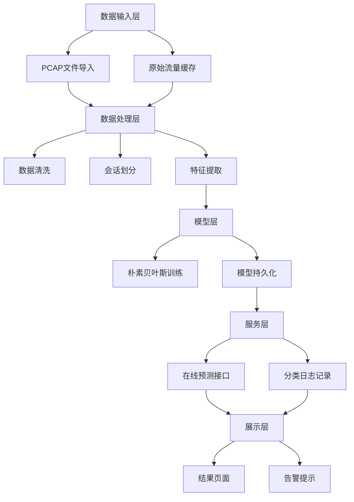
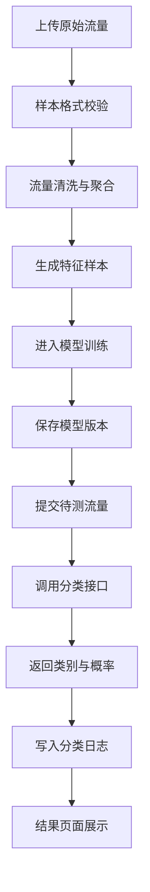
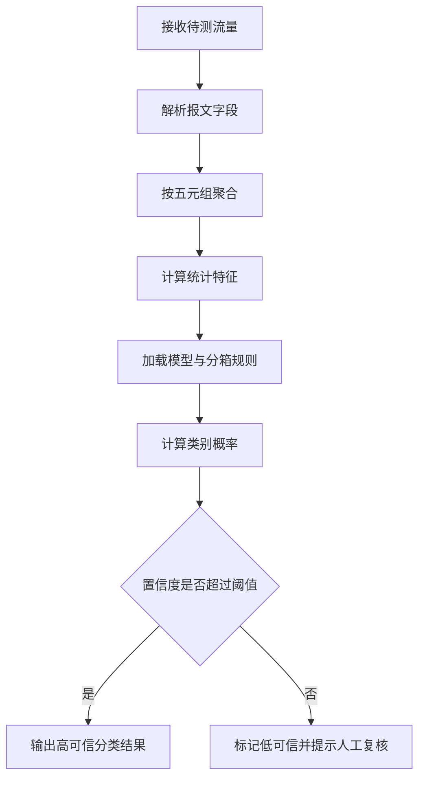
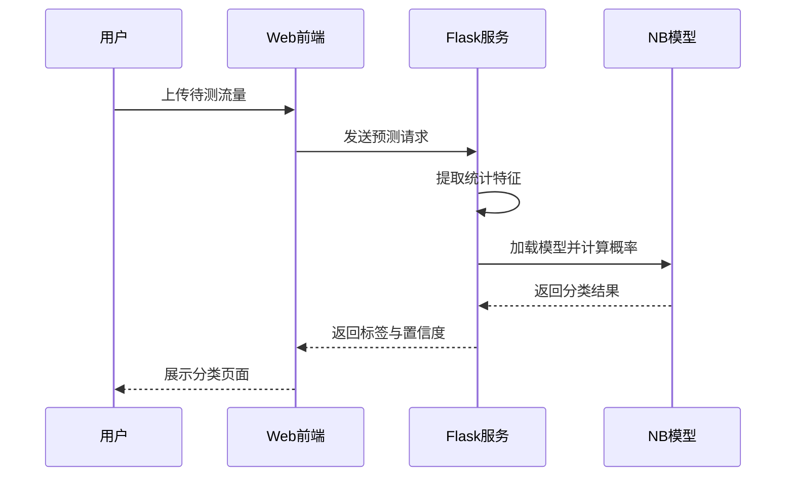
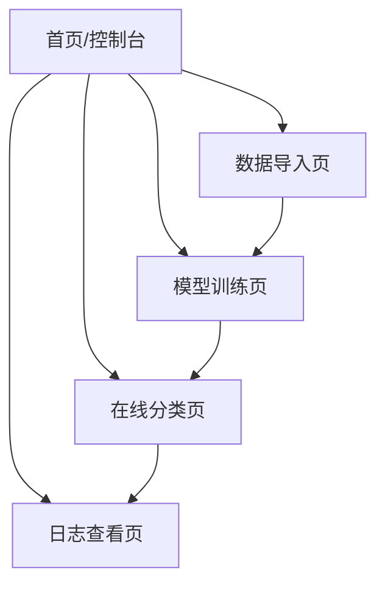
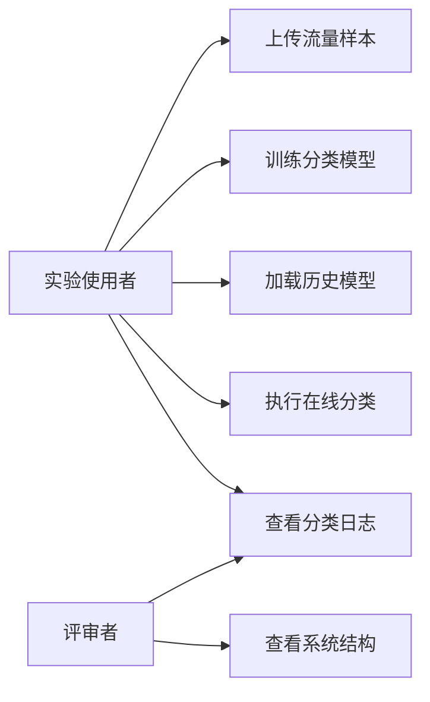
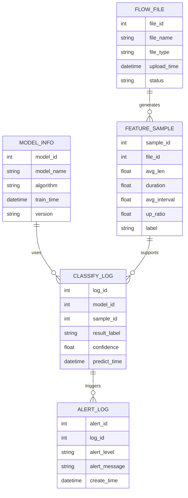
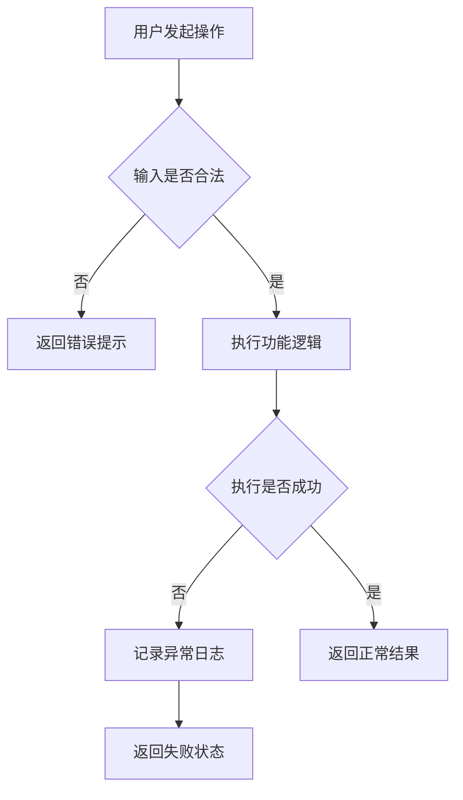
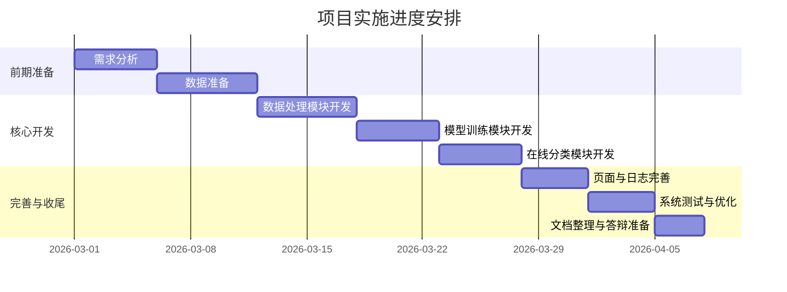

# 基于朴素贝叶斯的加密流量智能分类系统课程设计报告

## 摘要

随着 HTTPS、TLS、QUIC 等加密协议的大规模应用，传统依赖端口号、明文关键字和深度包检测的网络流量识别方法逐渐失效。虽然加密通信有效保护了用户隐私，但也给网络管理、带宽调度、行为分析和安全审计带来了新的挑战。在很多真实场景中，管理人员需要在不解密业务载荷的前提下，尽可能准确地识别不同类别的网络业务流量。因此，研究基于统计特征的加密流量分类方法，具有较强的现实意义和工程价值。

本文设计并实现了一套基于朴素贝叶斯的加密流量智能分类系统。系统以离线采集的网络流量数据为输入，对原始报文进行清洗、会话划分、特征提取和离散化处理，然后使用朴素贝叶斯算法完成模型训练，并在此基础上实现在线预测和结果展示。系统能够对视频流媒体、网页浏览、文件传输、即时通信、远程控制等典型加密流量进行自动分类，同时输出对应的类别概率和置信度信息。

与复杂的深度学习模型相比，朴素贝叶斯算法具有训练速度快、实现简单、可解释性较强等优点，更适合课程设计场景中的快速实现和结果展示。本文围绕系统背景、需求分析、实现原理、模块设计、关键代码、系统测试与创新点展开论述，验证了该系统在教学实验环境下具有较好的可行性、实时性和扩展性。

**关键词：**加密流量；朴素贝叶斯；流量分类；特征提取；网络安全

## ABSTRACT

With the rapid deployment of HTTPS, TLS and QUIC, traditional traffic identification methods based on port numbers and payload inspection are becoming less effective. Although encryption protects user privacy, it also creates new difficulties for traffic management, anomaly detection and security analysis. Therefore, it is necessary to study encrypted traffic classification methods that can work without decrypting packet payloads.

This report designs and implements an intelligent encrypted traffic classification system based on Naive Bayes. The system performs packet cleaning, flow generation, feature extraction, discretization, model training and online prediction on collected traffic data. It can classify several common encrypted traffic categories and provide confidence scores for classification results.

Compared with more complex deep learning solutions, the Naive Bayes method is lightweight, efficient and easy to interpret, which makes it suitable for course design projects. This report introduces the system background, design principles, implementation process, key code, testing and innovation points, showing that the system has good practicality in a teaching environment.

**Key words:** Encrypted traffic; Naive Bayes; Traffic classification; Feature extraction; Network security

---

# 第一章 绪论

## 1.1 作品概述

### 1.1.1 开发背景

在传统网络环境中，许多业务流量可以通过端口号、协议字段甚至应用层关键字进行识别，例如 HTTP 使用 `80` 端口，HTTPS 使用 `443` 端口，一些常见应用也具有较为明确的通信特征。但随着互联网应用逐渐走向统一加密，端口复用、协议伪装和隧道传输变得越来越普遍，单纯依赖规则匹配的识别方式已经难以满足实际需求。

一方面，网络管理员依然需要知道链路中到底运行着哪些业务，例如视频流量是否过大、文件传输是否异常、远程控制是否可疑。另一方面，直接解密用户业务数据又会带来隐私保护、部署成本和法律合规等问题。因此，如何在“不查看明文内容”的情况下，仅根据报文的统计特征来识别业务类型，成为当前网络流量分析研究中的重要方向。

在这一背景下，基于机器学习的加密流量分类方法逐渐受到关注。相比于完全依赖人工规则的传统方法，机器学习可以自动从样本中学习特征分布规律，更适合处理复杂多变的加密流量场景。本文选取朴素贝叶斯作为核心分类算法，构建一个轻量、清晰、可解释的课程设计系统。

### 1.1.2 研究目的

本系统的研究目的主要体现在以下几个方面：

1. 构建一套完整的加密流量分类流程，包括流量输入、预处理、特征工程、模型训练、在线预测和结果展示。
2. 验证朴素贝叶斯算法在加密流量分类任务中的可用性，为后续更复杂模型的引入提供对照基础。
3. 实现一个便于课程答辩和实验演示的原型系统，使使用者能够直观看到从原始数据到分类结果的完整过程。
4. 在不解密业务内容的前提下，实现对典型业务流量的自动识别，体现隐私保护与网络可观测性的平衡。

## 1.2 需求分析

### 1.2.1 现有方法分析

当前常见的流量识别方法主要包括端口号识别、深度包检测以及机器学习分类三类。

- 端口号识别方法实现简单，但容易受到动态端口、端口复用和代理转发影响。
- 深度包检测方法可以识别明文协议的细粒度特征，但面对加密流量时效果明显下降。
- 机器学习分类方法不依赖明文内容，能够从流量行为统计中学习类别差异，更适合当前加密网络环境。

因此，从课程设计的实现难度、实验资源和展示效果综合考虑，采用基于统计特征的机器学习方案更加合适。

### 1.2.2 目标用户

本系统主要面向以下场景：

- 网络安全与数据分析相关课程设计
- 校园实验室流量分析实验
- 中小型网络环境的业务行为识别
- 加密流量分类算法的教学演示与基础验证

这些用户通常更关注系统是否清晰、可运行、便于展示，而不一定追求极致的工业级精度。因此，本设计强调结构完整、逻辑清楚、实现可解释。

## 1.3 作品实现原理

### 1.3.1 Python 语言

Python 语言语法简洁、开发效率高，并拥有丰富的数据分析和机器学习生态，适合快速实现课程设计项目。通过 `pandas`、`numpy`、`scikit-learn` 等库，可以方便地完成数据处理、模型训练和结果分析。

### 1.3.2 Flask 框架

Flask 是轻量级 Web 开发框架，适合实现功能清晰、结构简洁的实验型系统。本文使用 Flask 搭建前后端交互接口，将流量导入、模型训练、分类预测与结果展示整合为统一平台。

### 1.3.3 加密流量特征基础

虽然加密协议隐藏了载荷内容，但流量本身仍保留大量统计特征，如：

- 单个会话中的报文数量
- 报文长度的分布情况
- 上下行方向比例
- 会话持续时间
- 相邻报文到达时间间隔

不同业务的通信行为在这些特征上通常存在明显差异。例如，视频流媒体往往具有连续、大流量、长持续时间的特点；远程控制流量则更倾向于短小、高频、强交互性通信。

### 1.3.4 朴素贝叶斯算法原理

朴素贝叶斯分类器基于贝叶斯定理构建，其核心思想是在给定样本特征的情况下，计算该样本属于各类别的后验概率，并取概率最大的类别作为最终分类结果。其数学表达式如下：

\[
P(C_k|X)=\frac{P(X|C_k)P(C_k)}{P(X)}
\]

其中：

- `C_k` 表示第 `k` 个类别
- `X` 表示待分类样本的特征向量
- `P(C_k)` 表示先验概率
- `P(X|C_k)` 表示条件概率

朴素贝叶斯假设不同特征在给定类别条件下相互独立。虽然这一假设在真实网络流量中并不完全成立，但在课程设计规模的数据集上，依然能够取得较稳定的效果，并且实现简单、易于解释。

### 1.3.5 流量预处理原理

原始网络报文不能直接用于模型训练，需要经过以下处理：

1. 去除异常值和缺失字段
2. 按五元组生成会话流
3. 统计每条会话的行为特征
4. 将连续值特征进行离散化
5. 构造成模型可识别的训练样本

这一过程的目的，是将“报文级数据”转换为“流级特征样本”，从而降低噪声影响并提高分类稳定性。

### 1.3.6 特征选择与离散化原理

系统选取的核心特征包括：

- 平均包长
- 最大包长
- 最小包长
- 报文总数
- 会话持续时间
- 平均到达时间间隔
- 上下行比例

由于朴素贝叶斯在处理离散特征时更加自然，因此系统将连续值划分为若干区间，并将其编码为离散特征值。这样既降低了极端值干扰，也便于在答辩时说明每个特征区间所代表的实际含义。

---

# 第二章 系统功能设计与实现

## 2.1 设计定位与目标

从文档定位上看，本系统并不只是一个单纯的算法实验程序，而是一个面向课程设计展示、具备完整业务闭环的“加密流量分类分析平台”。因此，在设计过程中，除了考虑朴素贝叶斯算法本身的可行性，还需要重点考虑系统的功能完整性、页面可展示性、操作流程清晰度以及后续扩展能力。

本系统的设计目标主要包括以下几个方面：

1. 实现从流量导入、样本处理、模型训练到在线分类的完整流程。
2. 提供清晰的功能模块划分，使每一项功能都能够独立说明和演示。
3. 强调“输入什么、系统做什么、输出什么”的产品逻辑，增强文档的设计感和策划感。
4. 让系统既能体现机器学习算法价值，又能体现一个课程项目应有的功能组织能力。
5. 为后续替换分类模型、增加流量类别、扩展日志分析能力预留接口。

从使用场景来看，该系统更适合作为一个“轻量级智能流量分析平台”进行展示，而不仅仅是一个离线训练脚本。因此，在功能设计上，应当将系统拆分为数据管理、模型管理、在线分类、结果展示和日志告警等多个模块。

## 2.2 用户角色与使用场景

为了使系统设计更加贴近真实使用方式，本文将系统的主要使用者抽象为以下两类角色：

- **实验使用者**：主要负责导入流量数据、训练模型、执行分类任务、查看结果，通常对应课程设计中的学生或实验操作者。
- **指导与评审者**：主要关注系统是否结构完整、功能是否清晰、流程是否连贯，通常对应课程设计答辩中的老师或评审人员。

围绕上述角色，系统可以覆盖以下典型使用场景：

1. 使用者上传一批加密流量样本，系统自动完成预处理并生成训练数据。
2. 使用者点击训练按钮，系统自动训练朴素贝叶斯模型并显示训练结果。
3. 使用者提交一条待测流量，系统返回预测类别及概率分布。
4. 使用者查看最近分类结果、异常样本和低置信度样本提示，辅助分析当前流量状态。



**图2-1 系统角色与使用场景图**

## 2.3 功能架构设计

从功能角度出发，系统整体可以划分为五个核心子系统：

| 功能子系统 | 主要作用 | 输入 | 输出 |
|---|---|---|---|
| 数据导入子系统 | 接收原始流量样本并完成校验 | `PCAP` 文件、结构化流量数据 | 原始流量记录 |
| 数据处理子系统 | 完成清洗、会话划分和特征构造 | 原始流量记录 | 特征样本数据 |
| 模型管理子系统 | 完成训练、测试、保存和加载模型 | 特征样本、标签数据 | 模型文件、评估结果 |
| 在线分类子系统 | 接收待测流量并返回分类结论 | 待测流量 | 类别标签、概率分布 |
| 展示与日志子系统 | 展示结果并记录分类历史 | 分类结果、模型状态 | 页面展示、日志记录 |

本系统总体上采用“数据输入层、数据处理层、模型层、服务层、展示层”的模块化结构。各模块之间耦合度较低，便于后续扩展和调试。



**图2-2 系统模块结构图**


**图2-3 系统总体流程图**

系统整体处理过程如下：

1. 输入原始加密流量数据。
2. 对原始报文进行清洗与过滤。
3. 根据五元组构建流级样本。
4. 提取统计特征并完成离散化。
5. 训练朴素贝叶斯模型。
6. 使用训练好的模型进行在线预测。
7. 将分类结果和置信度显示在界面中。

## 2.4 业务流程设计

为了增强文档的策划稿属性，本系统将完整业务划分为“样本准备流程”“模型训练流程”“在线预测流程”三条主线。其中，样本准备流程负责把原始流量转换为可用数据，模型训练流程负责生成可部署模型，在线预测流程负责把算法能力转化为界面可见结果。



**图2-4 业务主流程图**

这一路径体现了系统从“原始数据”到“结果服务”的完整闭环，也说明系统不仅关注训练阶段，还关注训练结果如何被调用和展示。这种设计方式更符合系统策划稿和功能设计文档的表达方式。

## 2.5 数据导入模块设计

数据采集模块主要负责接收实验样本，并将其转换为统一的数据结构。为了适应课程设计的演示需求，系统优先支持离线方式导入 `PCAP` 文件，也可以扩展为实时抓包方式。

该模块需要保证以下几点：

- 能够正确读取原始流量样本
- 能够识别时间戳、长度、地址、端口、协议等关键字段
- 对格式错误或字段缺失的数据进行拦截
- 为后续会话划分提供标准化输入

从功能设计角度看，数据导入模块至少需要包含以下子功能：

1. 文件选择与上传
2. 文件格式校验
3. 基础字段检查
4. 导入结果反馈
5. 导入失败提示

这样设计的目的是让“上传样本”成为一个完整、可交互、可反馈的功能，而不是单纯的一段脚本逻辑。

## 2.6 流量预处理模块设计

流量预处理模块是连接原始报文和机器学习模型的重要桥梁。其主要功能包括：

- 报文时间排序
- 异常记录过滤
- 五元组会话划分
- 流持续时间统计
- 上下行方向标记

为了避免同一会话因长时间空闲而被错误拼接，系统设置了超时阈值。当同一五元组中相邻报文间隔超过阈值时，系统会自动划分为新的流记录。



**图2-5 在线预测判定流程图**

在功能策划层面，预处理模块承担着“把不规则数据转化为系统可用数据”的职责，因此它不仅是算法前置步骤，更是平台稳定性的基础模块。如果该模块设计不清晰，后续模型训练和在线预测都会受到影响。

## 2.7 特征工程模块设计

特征工程模块是系统中最核心的部分之一，其质量直接影响最终分类结果。系统从每条流记录中提取以下统计特征：

- `packet_count`：报文数量
- `avg_len`：平均包长
- `max_len`：最大包长
- `min_len`：最小包长
- `duration`：流持续时间
- `avg_interval`：平均包间隔
- `up_ratio`：上行报文比例

在特征构造完成后，系统将连续变量转换为离散区间编号，使其更适合朴素贝叶斯算法处理。

### 2.7.1 特征提取核心代码

```python
import numpy as np

def extract_features(flow_packets):
    lengths = [pkt.length for pkt in flow_packets]
    times = [pkt.timestamp for pkt in flow_packets]
    directions = [pkt.direction for pkt in flow_packets]

    duration = times[-1] - times[0] if len(times) > 1 else 0
    intervals = np.diff(times) if len(times) > 1 else [0]
    up_ratio = directions.count("up") / max(len(directions), 1)

    return {
        "packet_count": len(flow_packets),
        "avg_len": float(np.mean(lengths)),
        "max_len": int(np.max(lengths)),
        "min_len": int(np.min(lengths)),
        "duration": float(duration),
        "avg_interval": float(np.mean(intervals)),
        "up_ratio": float(round(up_ratio, 4))
    }
```

上述代码完成了单条会话流的核心统计特征提取，适合作为系统中特征工程模块的基础函数。

从设计角度看，特征工程模块还应具备以下能力：

- 支持固定特征模板，便于不同批次实验保持一致
- 支持新增特征字段，便于后期扩展
- 支持特征结果导出，便于人工核查和答辩展示

因此，特征工程模块不仅服务于算法，也服务于系统的可维护性和实验可复现性。

## 2.8 模型管理模块设计

模型训练模块负责读取处理后的样本数据，构建朴素贝叶斯分类器，并输出训练结果和模型文件。考虑到课程设计的实现复杂度和展示需求，系统采用 `GaussianNB` 完成训练。

训练流程包括：

1. 读取特征数据和类别标签
2. 划分训练集与测试集
3. 构建朴素贝叶斯模型
4. 完成模型拟合
5. 输出分类评估结果
6. 将模型保存到本地文件


**图2-6 模型训练流程图**

### 2.8.1 模型训练核心代码

```python
from sklearn.model_selection import train_test_split
from sklearn.naive_bayes import GaussianNB
from sklearn.metrics import classification_report
import joblib

X_train, X_test, y_train, y_test = train_test_split(
    feature_df, label_df, test_size=0.2, random_state=42
)

model = GaussianNB()
model.fit(X_train, y_train)

y_pred = model.predict(X_test)
print(classification_report(y_test, y_pred))

joblib.dump(model, "models/nb_model.pkl")
```

该段代码展示了模型训练、测试和持久化的核心逻辑，结构简洁，适合直接写入课程设计报告。

除了训练功能外，模型管理模块在系统设计上还应该包含：

1. 模型版本命名
2. 模型训练时间记录
3. 模型加载与切换
4. 评估结果查看
5. 旧模型覆盖或保留策略

这部分内容能明显增强文档的“系统设计感”。因为在真正的平台设计中，模型不只是被训练一次就结束，而是需要被保存、被调用、被比较、被替换。

## 2.9 在线分类模块设计

在线分类模块的主要任务是接收待测流量，提取其统计特征，并调用已训练好的模型完成预测，最终返回分类标签和置信度。

系统在分类时不仅输出最终类别，还同时输出概率分布。当最高概率低于阈值时，系统将该样本标记为低可信样本，并建议人工复核。



**图2-7 在线分类接口时序图**

### 2.9.1 在线预测接口代码

```python
from flask import Flask, request, jsonify
import numpy as np
import joblib

app = Flask(__name__)
CLASS_NAMES = ["视频流媒体", "网页浏览", "文件传输", "即时通信", "远程控制"]

@app.route("/predict", methods=["POST"])
def predict_flow():
    payload = request.get_json()
    feature_vector = build_feature_vector(payload["packets"])

    model = joblib.load("models/nb_model.pkl")
    prob = model.predict_proba([feature_vector])[0]
    label_index = int(np.argmax(prob))

    return jsonify({
        "label": CLASS_NAMES[label_index],
        "confidence": round(float(np.max(prob)), 4),
        "probabilities": prob.tolist()
    })
```

该接口实现了从接收数据到返回分类结果的完整服务逻辑，体现了系统从算法模块到业务模块的衔接方式。

从功能设计上，在线分类模块至少应输出以下内容：

- 当前流量所属类别
- 最高后验概率
- 各类别概率分布
- 当前模型版本
- 是否为低可信样本

这样的设计不仅满足“分类”本身，还能让页面有足够的信息量，更符合一个展示型系统的设计需求。

## 2.10 结果展示与日志模块设计

为了使系统更适合答辩展示，结果展示模块采用界面化方式输出以下信息：

- 当前模型版本
- 当前样本预测类别
- 最大概率值
- 各类别概率分布
- 最近识别日志
- 低可信样本告警

这一设计能够增强系统的可解释性，也使得使用者更容易理解模型的输出结果。

为了让这部分更符合策划稿风格，可以将页面功能进一步拆为以下几个展示区域：

| 页面区域 | 功能说明 | 设计目的 |
|---|---|---|
| 顶部状态栏 | 显示当前模型名称、训练时间、数据集信息 | 让使用者快速了解当前运行环境 |
| 中央结果卡片 | 显示预测类别和最大概率值 | 突出系统核心输出 |
| 概率分布区 | 展示各类别概率对比 | 增强分类结果解释性 |
| 分类日志区 | 展示最近若干次分类记录 | 支持追踪与复核 |
| 告警提示区 | 对低可信样本进行高亮提示 | 提高系统可用性与决策辅助能力 |

上述设计说明表明，系统不仅有算法处理链路，也有较为完整的页面与功能规划，这也是策划型文档与普通实验报告之间的明显区别。

## 2.11 非功能需求设计

除核心业务功能外，系统设计还需要考虑若干非功能需求：

### 2.11.1 易用性

系统操作流程应尽量简化，使使用者能够通过“上传数据、训练模型、提交预测、查看结果”四个主要步骤完成整个实验过程。

### 2.11.2 可扩展性

系统应允许后续扩展新的流量类别、新的统计特征以及新的分类模型，例如随机森林、支持向量机、LSTM 等。

### 2.11.3 可维护性

各模块职责应尽量单一，便于后期单独修改数据处理逻辑、模型逻辑或展示逻辑，避免牵一发而动全身。

### 2.11.4 可展示性

考虑到课程设计答辩的实际需要，系统页面应尽量直观，输出内容应尽量清晰，功能命名应尽量明确，使评审者能够快速理解系统做了什么、怎么做、结果是什么。

## 2.12 功能需求分析

为了使系统设计文档更具完整性，下面从需求角度对各项核心功能进行归纳。与单纯描述算法不同，功能需求分析更强调“系统需要提供哪些能力”以及“这些能力要解决什么问题”。

### 2.12.1 核心功能需求

| 功能编号 | 功能名称 | 功能描述 | 优先级 |
|---|---|---|---|
| F1 | 流量文件导入 | 支持用户上传 `PCAP` 或结构化流量样本文件 | 高 |
| F2 | 数据格式校验 | 对上传文件的格式、字段完整性进行检查 | 高 |
| F3 | 会话划分 | 按五元组和时间阈值构建流记录 | 高 |
| F4 | 特征提取 | 从流记录中提取统计特征并形成样本 | 高 |
| F5 | 模型训练 | 训练朴素贝叶斯分类器并输出评估结果 | 高 |
| F6 | 模型保存与加载 | 支持模型文件持久化和后续复用 | 高 |
| F7 | 在线分类 | 对待测流量进行类别预测 | 高 |
| F8 | 概率展示 | 输出各类别概率分布和最大概率值 | 中 |
| F9 | 分类日志记录 | 保存分类时间、类别结果和模型版本 | 中 |
| F10 | 低可信样本告警 | 当置信度不足时给出提示 | 中 |

### 2.12.2 辅助功能需求

除核心功能外，系统还应具备一些辅助能力，用于增强平台的完整性和展示效果：

- 提供训练结果摘要，例如准确率、召回率、F1 值等。
- 支持查看最近分类记录，便于实验过程回溯。
- 支持模型版本标记，避免不同实验结果混淆。
- 支持错误提示信息展示，例如文件上传失败、模型未加载、输入字段缺失等。

### 2.12.3 功能优先级说明

从课程设计实现的角度看，`F1` 到 `F7` 属于系统最核心的闭环功能，必须优先完成；`F8` 到 `F10` 属于增强型功能，虽然不一定决定系统能否运行，但它们显著提升了系统的展示效果和完整度。因此，在实际开发安排上，可以采用“先实现闭环，再完善展示”的迭代方式。

## 2.13 页面原型与交互设计

为了让系统更像一个完整平台，而不只是若干脚本的组合，本文对页面结构进行简单规划。页面设计以“清晰、直观、便于演示”为原则，不追求复杂视觉效果，而强调信息组织是否合理。

### 2.13.1 页面规划

系统建议划分为以下几个主要页面：

| 页面名称 | 主要功能 | 核心元素 |
|---|---|---|
| 首页/控制台 | 展示系统简介和快捷入口 | 系统标题、功能入口、当前状态 |
| 数据导入页 | 上传样本并查看导入结果 | 上传按钮、文件信息、校验提示 |
| 模型训练页 | 训练模型并查看训练结果 | 训练按钮、参数区、评估结果 |
| 在线分类页 | 输入待测流量并查看分类结果 | 提交区域、类别结果、概率图 |
| 日志查看页 | 查看历史分类记录和告警信息 | 日志表格、筛选栏、告警状态 |

### 2.13.2 页面原型逻辑



**图2-8 页面原型跳转图**

### 2.13.3 页面交互说明

1. 用户首先进入首页，查看系统当前状态并选择功能入口。
2. 在数据导入页上传样本文件，系统完成校验并提示导入结果。
3. 在模型训练页点击训练按钮，系统输出训练结果并保存模型。
4. 在在线分类页提交待测流量，系统返回预测类别和概率分布。
5. 在日志查看页查看历史分类记录和低可信告警信息。

这种交互逻辑符合一般教学演示平台的使用习惯，也更容易在答辩时进行逐步展示。

## 2.14 功能清单与模块职责

为了进一步增强文档的设计感，下面将系统功能拆分为更细粒度的模块职责表。

| 模块名称 | 子功能 | 主要职责 | 是否核心模块 |
|---|---|---|---|
| 数据导入模块 | 文件上传、格式校验、导入反馈 | 将原始流量转换为系统可接收输入 | 是 |
| 数据预处理模块 | 清洗、排序、聚合、方向标记 | 将原始报文转化为流记录 | 是 |
| 特征工程模块 | 统计计算、离散化、样本输出 | 为训练和预测提供统一特征 | 是 |
| 模型管理模块 | 训练、评估、保存、加载 | 负责模型生命周期管理 | 是 |
| 在线分类模块 | 请求接收、特征生成、概率计算 | 对待测样本进行实时分类 | 是 |
| 结果展示模块 | 结果卡片、概率分布、日志展示 | 面向用户输出系统结果 | 是 |
| 告警辅助模块 | 阈值判断、异常提示 | 标记低可信样本和异常分类情况 | 否 |

通过上述拆分，可以看出系统设计并不是只有“训练”和“预测”两个动作，而是围绕这两个动作构建了一套配套功能体系，这更符合系统设计说明书的写作方式。

## 2.15 模块输入输出设计

在系统设计文档中，模块输入输出说明非常重要，因为它直接体现了模块边界是否清晰。下面给出主要模块的输入输出关系。

| 模块 | 输入 | 处理逻辑 | 输出 |
|---|---|---|---|
| 数据导入模块 | `PCAP` 文件、结构化样本文件 | 文件读取、格式校验、字段检查 | 原始流量数据 |
| 预处理模块 | 原始流量数据 | 去噪、排序、会话聚合 | 流记录 |
| 特征工程模块 | 流记录 | 统计计算、区间化编码 | 特征样本 |
| 模型管理模块 | 特征样本、标签数据 | 训练、测试、保存 | 模型文件、评估结果 |
| 在线分类模块 | 待测流量、模型文件 | 特征生成、概率预测 | 分类标签、概率分布 |
| 展示模块 | 分类结果、日志数据 | 页面渲染、状态展示 | 可视化页面 |

### 2.15.1 输入输出流转图


**图2-9 模块输入输出流转图**

该图说明系统中每一个模块都有相对明确的输入与输出对象，这样不仅便于实现，也便于在文档中解释系统是如何一步步组织起来的。

## 2.16 可行性分析

从策划稿角度来看，系统设计不能只说明“怎么做”，还需要说明“为什么值得做、能不能做成”。因此，本节从技术、实现、展示和扩展四个角度对系统进行可行性分析。

### 2.16.1 技术可行性

本系统使用的核心技术包括 Python、Flask、Pandas、Scikit-learn 等，均属于成熟、常见、资料丰富的开发技术。朴素贝叶斯算法实现难度较低，适合作为课程设计阶段的核心分类模型，因此技术实现风险相对较小。

### 2.16.2 实现可行性

从实现角度看，系统所需功能可以分阶段完成。前期只需完成数据读取、特征提取和模型训练，即可形成基础闭环；中期加入在线预测接口；后期再完善结果展示和日志功能。因此，该项目具有较好的分步实施条件。

### 2.16.3 展示可行性

本系统具备较强的答辩展示友好性。因为从首页、导入、训练、预测到日志查看，系统具备一条较清晰的演示链路。评审者可以直观地看到输入、处理、输出的全过程，这使其非常适合作为课程设计成果展示。

### 2.16.4 扩展可行性

本系统采用模块化设计，未来可以在不大幅修改原有流程的前提下，扩展新的流量类别、替换新的分类算法、增加新的可视化页面。因此，该系统不仅适用于当前课设任务，也具备后续继续完善的空间。

## 2.17 系统用例设计

为了让系统设计表达更贴近正式说明书，本节从“系统能为谁提供什么功能”的角度，对主要用例进行描述。与前面的功能清单不同，用例设计更强调用户动作与系统响应之间的关系。

### 2.17.1 核心用例说明

| 用例名称 | 参与者 | 前置条件 | 系统响应 |
|---|---|---|---|
| 上传流量样本 | 实验使用者 | 已进入数据导入页面 | 校验文件格式并返回导入结果 |
| 训练分类模型 | 实验使用者 | 特征样本和标签数据已准备完成 | 启动训练流程并输出评估结果 |
| 加载历史模型 | 实验使用者 | 模型文件已存在 | 加载指定模型并标记为当前模型 |
| 执行在线分类 | 实验使用者 | 当前模型已加载 | 返回分类标签、概率分布和置信度 |
| 查看分类日志 | 实验使用者、评审者 | 系统已有历史分类记录 | 展示历史结果和告警信息 |
| 查看系统结构 | 评审者 | 已进入系统说明页面 | 展示模块、流程与设计逻辑 |

### 2.17.2 用例关系图



**图2-10 系统用例关系图**

用例设计的意义在于，它把“系统内部怎么做”转换成“用户可以做什么”，从而使整份文档更像真正的系统设计稿，而不只是技术实现说明。

## 2.18 数据库与数据结构设计

虽然本系统属于课程设计原型，但为了让系统具备更完整的平台特征，仍然有必要对数据存储结构进行设计。这里的数据存储不一定必须使用复杂数据库，也可以是本地数据库或结构化文件，但在设计文档中，仍需明确系统要保存哪些核心信息。

### 2.18.1 主要数据实体

系统建议维护以下几类核心数据：

- 原始流量文件信息
- 处理后的特征样本
- 模型版本信息
- 分类结果记录
- 告警日志

### 2.18.2 数据实体关系图



**图2-11 数据实体关系图**

### 2.18.3 数据结构设计说明

1. `FLOW_FILE` 用于记录样本文件来源和导入状态。
2. `FEATURE_SAMPLE` 用于保存特征工程输出结果，是训练和预测的基础数据。
3. `MODEL_INFO` 用于管理模型版本、训练时间和算法类型。
4. `CLASSIFY_LOG` 用于记录每次分类任务的结果。
5. `ALERT_LOG` 用于记录低可信样本或异常分类产生的告警信息。

这种设计有助于后续从“单次实验脚本”过渡到“可追踪、可维护、可回看”的分析系统。

## 2.19 接口设计

接口设计部分主要说明系统前后端之间如何交互，以及不同功能模块之间传递什么数据。在设计文档中补充接口表，可以让整个系统显得更加工程化和规范化。

### 2.19.1 接口清单

| 接口名称 | 请求方式 | 作用 | 输入参数 | 输出结果 |
|---|---|---|---|---|
| `/upload` | `POST` | 上传流量样本文件 | 文件对象 | 上传状态、文件编号 |
| `/extract` | `POST` | 执行特征提取 | 文件编号或流量数据 | 特征提取结果 |
| `/train` | `POST` | 训练朴素贝叶斯模型 | 特征数据、标签数据 | 模型编号、评估结果 |
| `/load_model` | `POST` | 加载指定模型 | 模型编号 | 当前模型状态 |
| `/predict` | `POST` | 对待测流量执行分类 | 待测流量包数据 | 类别标签、置信度、概率分布 |
| `/logs` | `GET` | 查询分类日志 | 页码、筛选条件 | 日志列表 |
| `/alerts` | `GET` | 查询告警记录 | 时间范围、等级 | 告警列表 |

### 2.19.2 接口调用流程

```mermaid
flowchart LR
    A[前端页面] --> B[/upload]
    B --> C[/extract]
    C --> D[/train]
    D --> E[/load_model]
    E --> F[/predict]
    F --> G[/logs]
    F --> H[/alerts]
```

**图2-12 接口调用关系图**

### 2.19.3 接口设计说明

在课程设计场景中，接口数量不需要过多，但每个核心流程都最好有对应的独立接口。这样有两个好处：一是页面逻辑更加清楚；二是文档表达更加像完整系统，而不是把所有逻辑写在一个脚本文件里。

## 2.20 异常处理设计

在正式系统设计中，异常处理是不可忽略的一部分。即使本系统主要面向课程设计，也需要说明在典型失败场景下系统如何响应。

### 2.20.1 常见异常场景

| 异常场景 | 可能原因 | 系统处理方式 |
|---|---|---|
| 文件上传失败 | 文件损坏、格式不支持 | 拒绝导入并提示重新上传 |
| 字段缺失 | 样本数据不完整 | 返回字段错误信息 |
| 特征提取失败 | 报文解析异常 | 记录错误日志并终止当前任务 |
| 模型未加载 | 未训练模型或模型文件丢失 | 禁止预测并提示先训练或加载模型 |
| 预测失败 | 输入格式错误或服务异常 | 返回失败状态并记录异常日志 |
| 告警生成失败 | 日志写入异常 | 保留分类结果并提示告警模块异常 |

### 2.20.2 异常处理流程图



**图2-13 异常处理流程图**

### 2.20.3 异常处理设计意义

这部分内容可以明显增强文档的完整度，因为它体现出系统设计不仅考虑“正常流程”，也考虑“出错以后怎么办”。在课程答辩中，这类内容往往会给人更成熟的设计印象。

## 2.21 项目实施与开发安排

为了使文档进一步接近策划稿和设计说明书，还需要补充项目实施思路。该部分不要求完全严格的项目管理表达，但至少要说明开发过程如何推进。

### 2.21.1 实施阶段划分

| 阶段 | 主要任务 | 目标成果 |
|---|---|---|
| 需求分析阶段 | 明确系统目标、功能和使用场景 | 设计草案、功能列表 |
| 数据准备阶段 | 收集流量样本并整理标签 | 原始数据集、标签集 |
| 系统开发阶段 | 完成导入、预处理、训练、预测等模块 | 可运行原型系统 |
| 功能完善阶段 | 增加日志、告警、页面展示等功能 | 完整演示版本 |
| 测试与答辩阶段 | 功能测试、文档整理、演示准备 | 最终提交成果 |

### 2.21.2 实施进度示意图



**图2-14 项目实施进度图**

### 2.21.3 开发安排说明

从实施安排上看，系统开发应优先保障核心闭环，即先完成“数据导入-特征提取-模型训练-在线预测”四个关键环节，再逐步补充日志、告警和页面展示等增强功能。这样既符合课程设计的时间安排，也能确保在开发周期有限的情况下优先完成最重要的系统能力。

---

# 第三章 系统测试与分析

## 3.1 系统测试

### 3.1.1 数据导入测试

将多组加密流量样本导入系统，观察系统是否能够正确完成文件识别和字段校验。测试结果表明，系统能够正确读取实验样本，并将其转换为统一的数据结构。

### 3.1.2 会话划分测试

通过检查同一五元组下的流量记录，验证会话切分是否正确。测试结果表明，系统能够较好地区分不同会话，并避免将长时间空闲后的流量错误拼接到同一条流中。

### 3.1.3 特征提取测试

对若干典型流量样本进行人工核对，验证平均包长、持续时间、上下行比例等关键特征是否计算正确。测试结果显示，系统生成的特征值与原始流量行为基本一致。

### 3.1.4 模型训练测试

在训练阶段，重点关注模型是否能够正常完成拟合、输出评估结果并保存到本地。测试结果表明，系统训练流程完整，模型可重复加载，训练过程稳定。

### 3.1.5 分类结果测试

将未知流量输入系统，观察预测类别与实际行为是否大致对应。对于视频流媒体、文件传输和远程控制等差异较明显的业务，系统能够给出较清晰的概率区分。对于特征边界较模糊的样本，系统会通过低置信度机制进行提示。

### 3.1.6 可视化展示测试

测试结果界面的刷新速度、日志更新能力和置信度显示功能。结果表明，系统界面响应较快，能够满足课程答辩中的实时演示需求。

## 3.2 系统分析

### 3.2.1 准确性分析

由于不同加密业务在流量行为上具有一定差异，系统能够利用统计特征进行有效区分。虽然朴素贝叶斯模型较为简单，但在教学实验规模的数据集上，仍然具备一定识别能力。

### 3.2.2 实时性分析

系统在线预测阶段仅需要完成少量特征处理和概率计算，因此计算开销较小，适合在普通实验主机上运行。相比复杂的深度学习模型，本设计更适合课程项目中的快速展示。

### 3.2.3 可扩展性分析

系统采用模块化结构，后续若需要加入支持向量机、随机森林或深度学习模型，可以在保留数据处理流程的前提下替换算法层，具备较好的扩展能力。

### 3.2.4 可解释性分析

朴素贝叶斯算法的优势之一是可解释性较强。系统可以输出类别概率分布，而不是只给出单一标签，从而帮助使用者理解系统为何将某条流量判定为某一类别。

### 3.2.5 部署方便性分析

系统主要依赖 Python 常见库，部署环境要求较低，可运行于 Windows 或 Linux 实验环境中。对于课程设计来说，这种实现方式更容易复现和移植。

---

# 第四章 创新性说明

本系统的创新性主要体现在以下几个方面：

1. **研究对象具有现实意义。** 系统针对的是当前广泛存在的加密流量识别问题，而不是传统明文业务分类问题。
2. **在不解密内容的前提下完成识别。** 该设计兼顾了用户隐私保护和网络管理需求。
3. **采用轻量级机器学习方法完成全流程实现。** 朴素贝叶斯算法结构简单、训练效率高，适合作为教学环境中的实现方案。
4. **实现了从数据输入到在线预测的完整闭环。** 系统不仅有算法部分，还有服务接口和结果展示模块，整体性更强。
5. **增加了置信度与低可信提示机制。** 这使得系统不只是给出分类标签，还能进一步反映结果的可靠程度。

---

# 第五章 总结

本文围绕“基于朴素贝叶斯的加密流量智能分类系统”这一主题，设计并实现了一套适用于课程设计场景的原型系统。该系统以加密流量为研究对象，通过报文清洗、会话划分、特征提取、离散化处理、朴素贝叶斯训练和在线预测，实现了对典型业务流量的自动识别。

从整体效果来看，本系统具有以下特点：结构清晰、实现完整、部署成本低、演示效果较好，能够较为直观地体现机器学习在网络流量分类中的应用价值。同时，系统还保留了进一步扩展的空间，例如增加更多流量类别、优化特征选择、引入更强的分类模型等。

当然，本系统也存在一定局限性。例如，朴素贝叶斯的独立性假设与真实网络行为并不完全一致，数据集规模和样本质量也会影响最终分类效果。后续可以进一步引入随机森林、支持向量机或深度学习方法，并与当前模型进行对比，以获得更高的分类精度。

---

# 参考文献

[1] 李航. 统计学习方法[M]. 北京: 清华大学出版社.  
[2] 周志华. 机器学习[M]. 北京: 清华大学出版社.  
[3] Richard O. Duda, Peter E. Hart, David G. Stork. Pattern Classification[M].  
[4] Scikit-learn Developers. Naive Bayes User Guide[EB/OL].  
[5] 潘柱廷, 王震. 加密流量识别技术研究综述[J]. 计算机工程与应用.  
[6] 王磊, 马会超. 基于统计特征的加密流量分类方法研究[J]. 计算机应用研究.  
[7] 周海军. 网络流量分析与异常检测技术[M].  
[8] 陈恺, 李晨. 基于机器学习的网络流量识别技术研究[J]. 信息安全研究.  
[9] 张涛. Python数据分析与挖掘实战[M].  
[10] 付强. 网络安全态势感知中的流量分类技术研究[D].  

---

# 致谢

本课设报告的完成离不开指导老师在选题、结构设计和技术实现方面的帮助，也离不开同学们在实验调试、样本整理和内容修改中的支持。通过本次课程设计，我对加密流量分析、特征工程和机器学习分类方法有了更加系统的理解，也进一步认识到将理论方法落地为实际系统的重要性。

在此，向所有给予我帮助和支持的老师、同学和家人表示诚挚的感谢。
